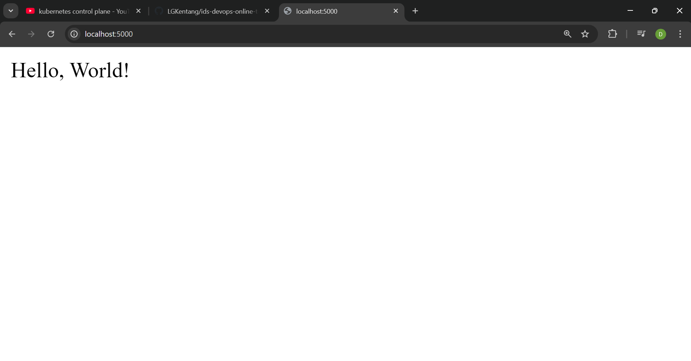
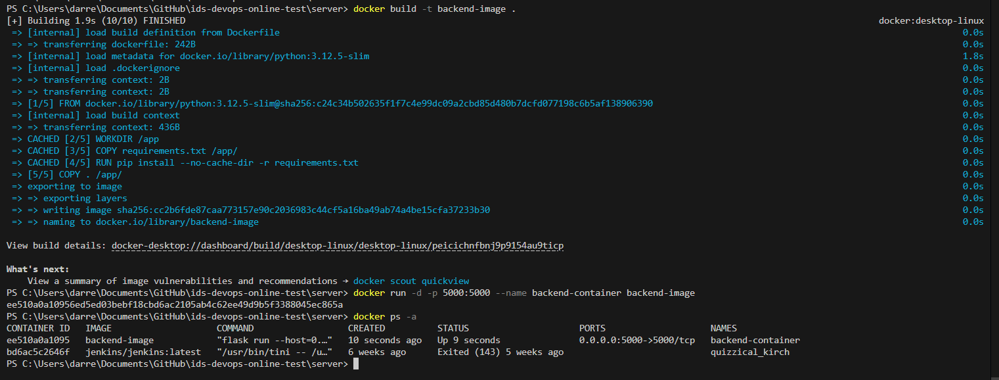
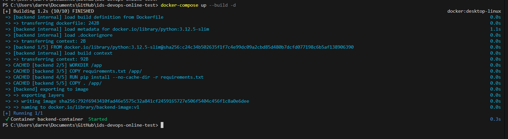

# Steps for Containerizing an Application

## Prerequisites
- Install Docker on your local machine. You can download it from [Docker's official website](https://www.docker.com/get-started).

## Step 1: Create a Dockerfile
A Dockerfile is a text document that contains all the commands to assemble an image. Here’s a simple example that I used in this repository :

```dockerfile
FROM python:3.12.5-slim # Pulls the official base image
    
WORKDIR /app # In the docker /app directory

COPY requirements.txt /app/ # Copy all the requirements to that directory

RUN pip install --no-cache-dir -r requirements.txt # Install all libraries needed there

COPY . /app/ # Copy all the files needed to that directory

EXPOSE 5000 # Expose the docker port (5000) to access the service later

CMD ["flask", "run" ,"--host=0.0.0.0"] # Run this command at the docker environment
```

## Step 2: Build the image
Simply build the image by using the command down below ```-t``` suggests that the image could be tagged, for example ```backend-image:v1``` means that the image name is ```backend-image``` with the tag ```v1```, otherwise it will be ```latest``` by default.
```bash
docker build -t backend-image .
```

## Step 3: Run the container
After building the image, the last thing to do is to run the container from the image we built, use this command below
- ```-d``` means it's detached, the command line won't be interrupted by the docker terminal, and we can access it later using ```docker exec```
- ```p-``` means what port we want to map the local machine to the docker port, in this case ```[local_machine_port]:[docker_container_port]```

```bash
docker run -d -p 5000:5000 --name backend-container backend-image
```

### Step 4: Open the web server
Try opening localhost:5000, it will open the server showing ```Hello World```
```
curl localhost:5000
```



#### And that's it!


#### Alternatively you could use docker-compose to automate the image build and running a container automatically by using a docker-compose.yml file which we could configure in a human readable way.

### Alternative Step (docker-compose)
By creating a compose file, you can specify the services you want to compose, allowing you to build and run multiple images at once. There are many configurations to explore in the Docker Compose file that could benefit containerization in the future. Here’s an example of a Docker Compose file for this environment:
```docker
services:
  backend:
    build:
      context: ./server
      dockerfile: Dockerfile
    container_name: backend-container
    image: backend-image:v1
    ports:
      - "5000:5000"

```

Then just tell docker to use the compose file, building all the containers, utilizing ```-d``` to detach from the services so our terminal stays clean.
``` bash
docker-compose up --build -d
```


## Reference Images

